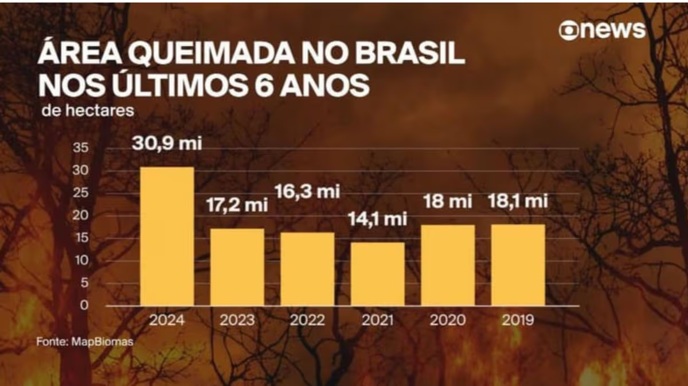

# Primeira Impressão Enganosa

Este gráfico do portal G1 traz um levantamento da área queimada no Brasil durante 6 anos. No entanto, é um gráfico tendencioso uma vez que inverte a contagem de tempo. Olhando atentamente, notamos que o valor mais alto, primeiro a ser exibido, é na verdade o ano mais recente.

Mas, nosso cérebro está acostumado a lidar com a esquerda sendo o início e a direita o fim. Então, quando vemos depressa, temos a falsa sensação de que as queimadas diminuíram ao longo dos anos, o que não aconteceu.

Na minha visão, este erro não foi acidental, e sim uma tentativa de suavizar o cenário alarmante 'mascarando' a informação mais importante.



Através do R, eu recriei o gráfico exibindo corretamente os valores em ordem cronológica.

```{r}
#| echo: FALSE
#| warning: FALSE
#| message: FALSE
queimadas <- data.frame(
  ano = c(2019, 2020, 2021, 2022, 2023, 2024),
  hectare = c(18.1, 18, 14.1, 16.3, 17.2, 30.9)
)

library(ggplot2)
ggplot(
  queimadas,
  aes(x = ano, y = hectare)
) +
  geom_col(aes(fill = 'red')) +
  labs(
    title = 'ÁREA QUEIMADA NO BRASIL NOS ÚLTIMOS 6 ANOS',
    subtitle = 'de hectares',
    x = 'Anos',
    y = 'Milhões de hectares'
  )

```
